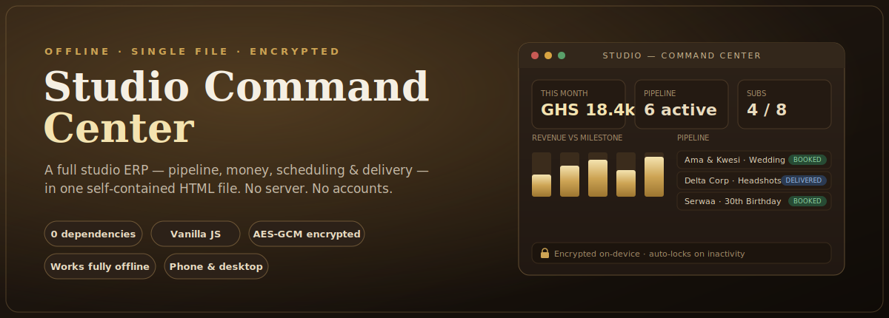

<div align="center">



# Studio Command Center

**A complete operations dashboard for a photography &amp; videography studio — built as a single, offline-first HTML file with client-side encryption, zero dependencies, and no build step.**

[](LICENSE)


[**▶ Live demo**](https://patrickdugo.github.io/svs-command-center/?demo) &nbsp;·&nbsp; [Features](#features) &nbsp;·&nbsp; [Architecture](docs/ARCHITECTURE.md) &nbsp;·&nbsp; [Run locally](#run-it-locally)

</div>

---

## Why I built this

I run a photography and videography studio and needed one place to run the whole business — leads, bookings, shoots, deliveries, invoices, cash-flow, and growth targets — without paying for five different SaaS tools or trusting my numbers to someone else's cloud.

So I built the whole thing into **one HTML file**. It runs on any phone or laptop with a browser, works fully offline, keeps every byte of data on the device (encrypted), and can be moved around by sending a single file. No server, no accounts, no subscriptions, no build tooling.

It's deliberately a constraint-driven project: *how much real product can live in one self-contained file?* The answer turned out to be "a surprising amount."

## Live demo

**[patrickdugo.github.io/svs-command-center/?demo](https://patrickdugo.github.io/svs-command-center/?demo)**

The `?demo` flag loads a fictional studio pre-filled with sample clients, payments and subscriptions, and skips the passcode so you can click straight in. Demo data lives in memory only and resets on reload — it never touches storage.

Open the site **without** `?demo` to experience the real first-run flow: create a passcode, receive a one-time recovery code, and start from an empty, encrypted dashboard.

## Features

**Sales &amp; clients**
- Lead → booked → delivered → closed pipeline with one-tap stage advancement
- Per-client cards: fee, deposit, balance, event date, venue, shoot times, image count, delivery SLA, brief and notes
- Auto-generated, on-brand documents per client — invoice, contract, receipt, delivery note — rendered to print/PDF from a single set of business details

**Money**
- Every payment is automatically split across four buckets (**50 / 20 / 15 / 15** — Personal / Studio Growth / Tax / Buffer) and logged to a ledger
- Income, expenses, per-bucket balances, and progress against monthly revenue milestones
- Backup &amp; restore the entire business as a single JSON file (device-to-device portability)

**Subscriptions**
- Recurring "Business Online Pack" clients with a built-in **auto-scheduler** that batches visits by location into weekday 3-hour blocks, respects capacity, and lets you lock/edit any visit manually

**Operations &amp; growth**
- Unified calendar across one-off shoots and subscription visits
- Delivery tracker with SLA countdowns, backup checklist, risk register
- Month-by-month revenue plan, task board, and an embedded editing/skills course

**Platform**
- Fully responsive (built phone-first), installable via "Add to Home Screen"
- Dark-mode aware, subtle animations, brand watermark
- Works with the network cable unplugged

## Security model

- On first run the app asks for a passcode and generates a **one-time recovery code**.
- All business data is encrypted at rest in the browser with **AES-GCM (256-bit)**; the key is derived from the passcode via **PBKDF2 (SHA-256, 310k iterations)**.
- The design uses **master-key wrapping**: a random data key is wrapped by both the passcode-key and the recovery-key, so the passcode can be reset with the recovery code **without re-encrypting** the data.
- Auto-lock on inactivity; exponential-backoff lockout after repeated wrong attempts.
- Nothing ever leaves the device. There is no server and no telemetry.

See [`docs/ARCHITECTURE.md`](docs/ARCHITECTURE.md) for the full data-flow and crypto write-up.

## Tech

Vanilla **HTML + CSS + JavaScript**. No framework, no bundler, no dependencies. Web platform only:

- **Web Crypto API** — PBKDF2 + AES-GCM encryption and key wrapping
- **localStorage** — encrypted persistence, per-device
- **CSS** — custom properties, grid/flex, `prefers-color-scheme`, print stylesheets for the generated documents
- Render-by-id UI: a small state object drives pure render functions

Everything — styles, scripts, fonts fallbacks, logo (inlined as a data URI) — ships in `index.html`.

## Run it locally

No install, no build:

```bash
# clone, then just open the file
git clone https://github.com/PatrickDugo/svs-command-center.git
cd svs-command-center
open index.html          # macOS  (use "start" on Windows, "xdg-open" on Linux)
```

Or try the seeded demo in any browser:

```
index.html?demo
```

> The encrypted vault requires a secure context (`https://` or `file://` / `localhost`). GitHub Pages serves over HTTPS, so the live link supports the full passcode flow.

## Project structure

```
svs-command-center/
├── index.html                 # the entire application (UI + logic + crypto + styles)
├── README.md
├── LICENSE                     # MIT
├── docs/
│   ├── ARCHITECTURE.md         # data model, state flow, crypto design
│   └── FEATURES.md             # full feature walkthrough
├── screenshots/                # imagery used in this README
└── .github/workflows/pages.yml # auto-deploy the demo to GitHub Pages
```

## Roadmap

- Optional encrypted cloud sync (bring-your-own storage)
- CSV export for accountants
- Multi-user / assistant PIN with scoped permissions
- PWA service worker for true installable offline app

## Author

**Patrick Selasie Dugo** — photographer &amp; self-taught builder, Accra, Ghana.
Built end-to-end as a real tool for a real studio, then generalised into this template.

## License

[MIT](LICENSE) © 2026 Patrick Selasie Dugo
